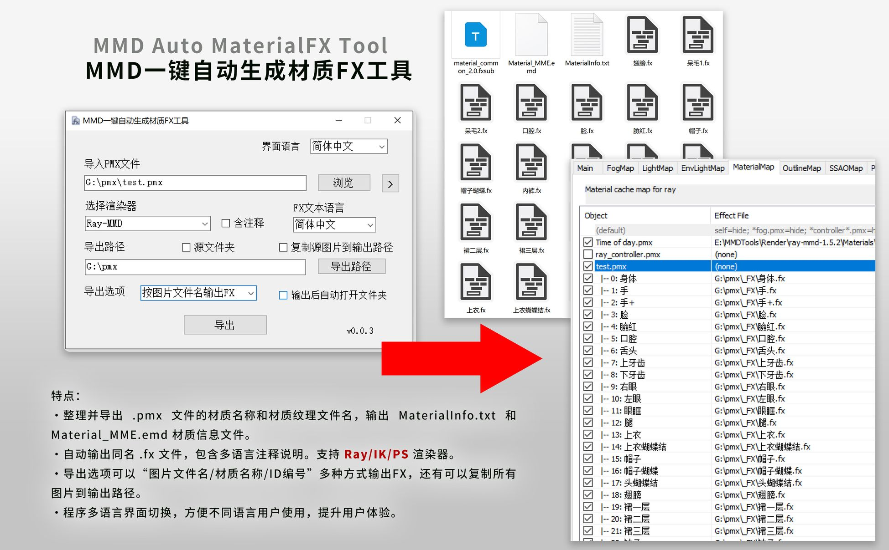
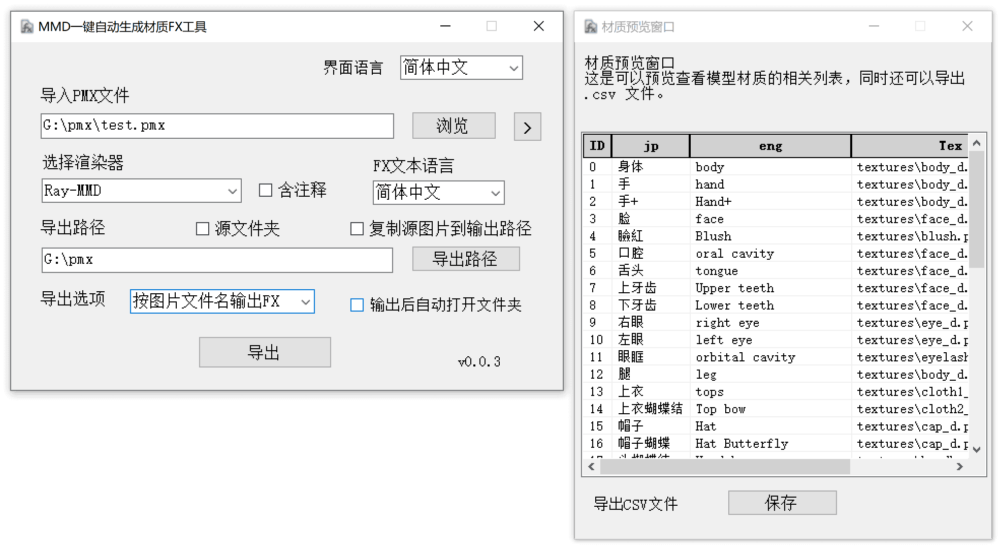
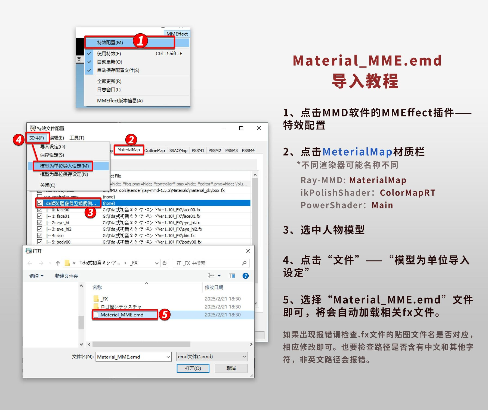

<h1 align="center">MMD Auto MaterialFX Tool</h1>

<p align="center">
<font size="10px">MMD一键自动生成材质FX工具</font><br />

</p>
 
<p align="center">
  
    <br /><br />
    <a href="LICENSE"></a>
    <a href="https://github.com/SaraKale/MMD_Auto_MaterialFX_Tool/releases"></a>
    <a href=""></a>
    <a href=""></a>
</p>

<p align="center">
language：<a href="README_en.md">English</a> | <a href="README_tw.md">繁體中文</a>  | <a href="README_jp.md">日本語</a>
</p>

## 介绍

本工具专为需要整理PMX文件材质并导出.FX文件的用户设计，旨在简化繁琐的手动操作，显著提升工作效率。

适用于：有自带高光和法线贴图的模型，或者自己做了高光和法线的贴图文件也可以。

## 主要特点

### 1、材质信息整理与导出
    
- 自动整理PMX文件中的材质名称和图片文件名，生成 `MaterialInfo.txt` 和 `Material_MME.emd` 两个材质信息文件，方便后续使用。

### 2、自动生成.FX文件
 - 工具会自动生成与“**图片文件名/材质名称/ID编号**”同名的.FX文件，支持多语言注释说明，兼容**Ray、ik、PS**渲染器，满足不同用户的需求。

### 3、灵活的导出选项
 - 提供多种导出方式，用户可以根据需求选择按“**图片文件名**”、“**材质名称**”或“**ID编号**”输出 **.FX** 文件。
 - 支持将PMX文件中的所有图片复制到输出路径，确保文件的完整性和便捷性。

### 4、多语言界面支持
 - 工具界面支持多语言切换，方便不同语言用户使用，提升用户体验。

仅适用于 **.pmx** 文件，如果是 .pmd 文件请自行保存新的 pmx 文件再处理。  
图标是我随便画的，最后感谢 ChatGPT 和 Github Copilot 帮助我完成了代码编写。

## 视频教程

youtube：https://youtu.be/Y06DieqjSjY  
bilibili：https://www.bilibili.com/video/BV1g19BYNEN3/

## 下载

请选择下面任意节点下载。

|   节点    |                                    链接                                    |
| :------: | :-----------------------------------------------------------------------: |
|  Github  | [releases](https://github.com/SaraKale/MMD_Auto_MaterialFX_Tool/releases) |
|  Gitee   | [releases](https://gitee.com/sarakale/MMD_Auto_MaterialFX_Tool/releases)  |
| bowlroll |                  [链接](https://bowlroll.net/file/332134)                  |
| aplaybox |        [链接](https://www.aplaybox.com/details/model/bwRV3QHtSab9)         |
| lanzouu  |            [链接](https://wwiu.lanzouu.com/b0ra0k71g) 密码:2u4e            |

## 运行环境

操作系统要求：Windows 7 SP1 以及 更高系统版本

需要有 Microsoft .NET Framework 4.8 运行环境  
下载：https://dotnet.microsoft.com/zh-cn/download/dotnet-framework/net48

## 注意

程序文件夹内的 `Renderer` 文件夹和 `CustomRules.ini` 文件请不要移动或删除，它是非常重要的，用于导出 .fx 文件。  
由于我是使用了AI辅助编写代码，难免有问题，如果有修改代码的意愿欢迎提交，谢谢！

## 编译构建

我的开发环境：  
系统：Windows 10  
环境：[Visual Studio 2022](https://visualstudio.microsoft.com/)  
框架：.NET Framework 4.8  
语言：C# 12.0  
需要安装Nuget包：  
 - [PMX Parser](https://www.nuget.org/packages/PMXParser)
 - [Fody](https://www.nuget.org/packages/Fody)
- [Costura.Fody](https://www.nuget.org/packages/Costura.Fody)

直接运行`PMX Material Tools.sln`编译即可。

或者其他方式编译，例如**dotnet**编译：
```
dotnet build PMX Material Tools.csproj --framework net48
```

## 使用方法

 - 1、直接运行 **MMD Auto MaterialFX Tool.exe** 程序即可。

 - 2、默认是English语言，在右上角选择 **Language** 可以切换到你喜欢的语言。

 - 3、导入PMX文件：
   - 点击右边按钮导入 `.pmx`文件，也可以把 `.pmx` 文件直接拖入到地址栏里。
      按钮旁边 `>` 是可以点击查看当前模型的材质列表，可快速阅览，同时还可以导出 **.csv** 文件。

- 4、选择渲染器：
   - 这是选择你的主渲染，如果不选择任何选项，默认是无，则直接输出 `MaterialInfo.txt` 材质信息文件。
   - 选择任意选项，将会输出相关的 **.fxsub / .fx**文件，根据纹理文件名自动重命名为相同的名称，如果文件名末尾含有高光贴图 `_s`/`_Specular` 和法线贴图 `_n`/`_Normal` 文件名，将会自动在fx文件添加相关的文件名路径。当然这个名称并不是通用的，具体还是要自己修改，如果出现错误请检查贴图文件名。或者自己去增加 `CustomRules.ini` 的重命名自定义规则。
     - 目前有以下渲染：
     - Ray-MMD 
     - ikPolishShader
     - PowerShader

- 5、含注释：
      如果勾选注释说明，同时选择了“**FX文本语言**”，会输出含有注释说明的文件。

- 6、FX文本语言：
   - 这里是可以选择 .fx 文本的编码语言，更方便查看修改代码，需要勾选前面的注释选项。
     - 目前有这些语言：
     - English
     - 简体中文
     - 繁體中文
     - 日本語

- 7、导出路径：
   - 这里如果先导入了 .pmx 文件，它会自动填入地址。
   - 也可以手动按右边按钮选择文件夹，也可以把路径粘贴到地址栏里。
   - 如果勾选“`源文件夹`”会自动输出到贴图文件夹里面，无需手动选择。
   - 如果勾选“`复制源图片到输出路径`”会将所有图片复制到导出文件夹，建议手动选择路径时使用。
   - 导出后会自动创建“渲染器_FX_日期序号”的文件夹。

- 8、导出选项：
   - 导出时可以按照喜好选择：
   - "无"：默认只输出 MaterialInfo.txt 文件。
   - "按图片文件名输出FX"：输出以贴图文件名命名的.fx文件。
   - "按材质名称输出FX"：输出以材质名称命名的.fx文件。
   - "按ID编号输出FX"：输出以ID数字编号命名的.fx文件。    
- 9、输出后自动打开文件夹：
   - 当输出成功后会自动打开导出的文件夹。

- 10、最后可以到 MMD 里打开 MME 插件在 **Material** 栏导入 `Material_MME.emd` 文件，将会自动加载材质文件。
   - 方法是打开 MMEffect 插件，在 Material 栏选中模型，然后点击“`文件`”——“`模型为单位导入设定`”，载入 `Material_MME.emd` 文件，就会自动上材质了。
   - 在此期间尽量不要更改材质顺序，否则会对应不上，如果改变了材质顺序则需要重新输出 .emd 文件。
   - 如果出现报错则是 .emd 文件语言编码设置错误，通常修改文件编码即可，或者自己重新在MME赋予材质。
     - 各地区字符编码：
     - 通常：UTF-8
     - 简体中文：GB18030
     - 繁体中文：BIG5
     - 日语：shift_jis
     - 朝鲜：EUC-KR
     - 俄罗斯：KOI8-R
     - 拉丁字符：WINDOWS1250


## 问题解答 FAQ

Q：无法边加载特效文件：xxxx.fx  Error:failed to open file: xxxx.tga (parameter:AlbedoSubMap)  
A：这是因为高光贴图文件名和法线贴图文件名名称不对，程序只判断了高光贴图 _s/_Specular 和法线贴图 _n/_Normal的名称，无法做到全部通用，请自行检查修改 .fx 的文件路径。

Q：导入Error:failed to open file:xxxx.png (parameter:NormalMap)  
A：这是因为没有找到相关的图片，请将 .fx 文件导出或复制到贴图文件夹里面。

Q：FX文件没有生成导出。  
A：请重启软件再尝试一次，因为偶尔会有点延迟BUG……

Q：MaterialMap栏贴上材质后变黑  
A：可能是模型法线错误，请检查模型的法线，或者调整 .fx 文件法线的数值，也有可能是法线贴图文件名错误，请检查是否有对应的法线贴图文件。

Q：导出程序未响应  
A：这是因为目录内已有.fx文件，如果不需要可删除文件再重新生成，记得提前备份文件。

Q：复制图片文件失败："xxx.png"正由另一进程使用，因此该进程无法访问此文件。  
A：这是因为当前文件可能在被其他应用占用，请关闭相关占用的程序，然后再复制图片即可。

Q：我可以申请添加 xx 翻译语言吗？  
A：当然可以！请给我留言，我会在后续新增。

## 确认状态

目前确认可以分发材质文件的渲染器如下：

Ray-MMD v1.5.2 	by:Rui  
https://github.com/ray-cast/ray-mmd  
ikPolishShader v_028	by:ikeno  
https://ux.getuploader.com/ikeno/  
PowerShader v3.2		by:角砂糖  
https://bowlroll.net/user/443942

如果有需要添加的渲染器可以告知我，我会添加上去，不过还是要查看作者是否允许分发。

## 使用事项

 - 禁止任何商业性质行为
 - 允许修改源码再发布，用于完善程序问题。
 - 关于使用工具产生的任何问题，作者概不负责。

## 来源

使用库：  
PMX Parser         by:ikorin24  
https://github.com/ikorin24/PMXParser
Fody       by:Fody  
https://github.com/Fody/Fody  
Costura.Fody     by:geertvanhorrik,simoncropp  
https://github.com/Fody/Costura  

AI代码辅助：  
ChatGPT  
Github Copilot  

## 许可证

使用 [MIT License](LICENSE) 许可证

## 截图展示




