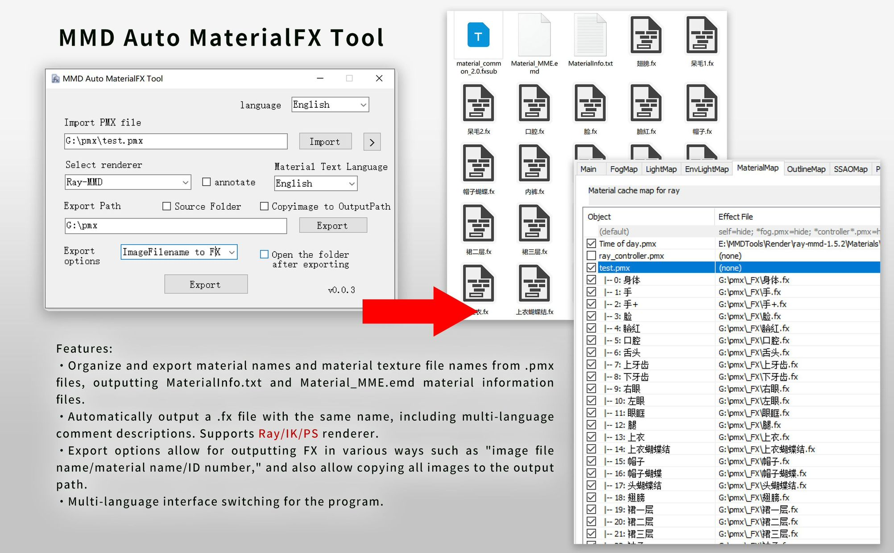
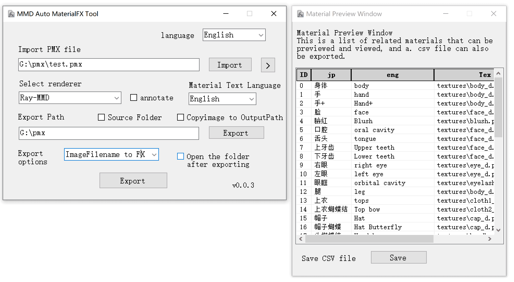
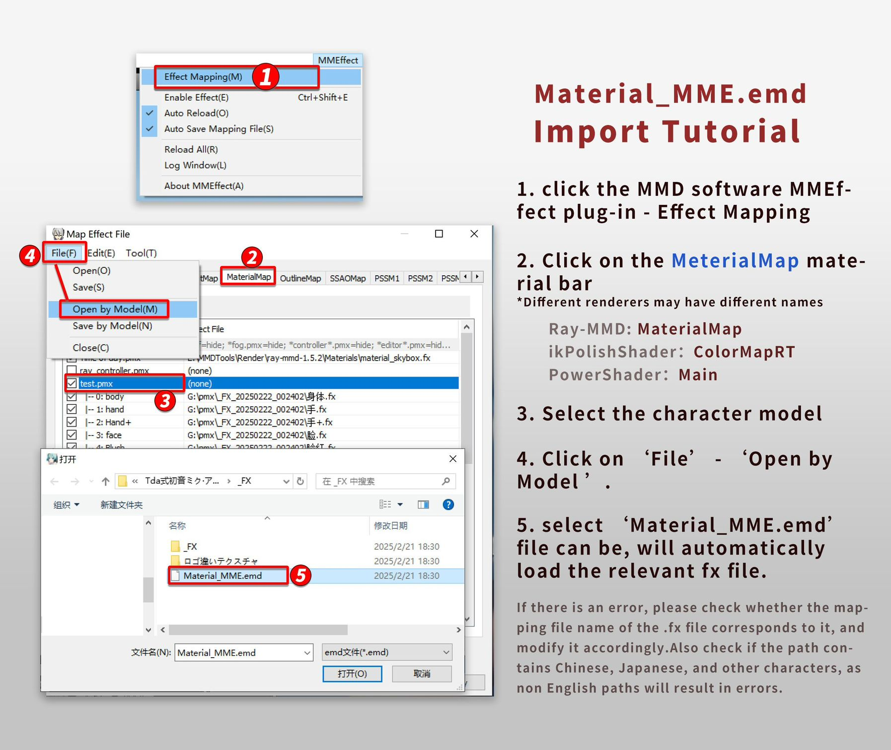

<h1 align="center">MMD Auto MaterialFX Tool</h1>

<p align="center">
  
  <br /><br />
  <a href="LICENSE"></a>
  <a href="https://github.com/SaraKale/MMD_Auto_MaterialFX_Tool/releases"></a>
  <a href=""></a>
  <a href=""></a>
</p>

<p align="center">
  language：<a href="README.md">简体中文</a> | <a href="README_tw.md">繁體中文</a> | <a href="README_jp.md">日本語</a>
</p>

## Introduction

This tool is designed for users who need to organize PMX file materials and export .FX files, aiming to simplify tedious manual operations and significantly improve work efficiency.

Applicable to: Models with multiple types of maps (PBR), such as diffuse, specular, normal, shininess, roughness, metallicness, ambient occlusion maps, etc.

## Key Features

### 1. Material Information Organization and Export

- Automatically organizes material names and image file names from PMX files, generating `MaterialInfo.txt` and `Material_MME.emd` files for subsequent use.

### 2. Automatic .FX File Generation

- The tool automatically generates .FX files named after "**image file name/material name/ID number**", supporting multi-language comments and compatibility with **Ray, ik, PS** renderers to meet different user needs.

### 3. Flexible Export Options

- Provides multiple export methods, allowing users to choose to output .FX files based on "**image file name**", "**material name**", or "**ID number**".
- Supports copying all images from the PMX file to the output path, ensuring file integrity and convenience.

### 4. Multi-language Interface Support

- The tool interface supports multi-language switching, making it user-friendly for different language users.

Only applicable to **.pmx** files. If you have a .pmd file, please save it as a new .pmx file before processing.
The icon is something I drew casually. Finally, thanks to ChatGPT and GitHub Copilot for helping me complete the code.

## Video Tutorials

youtube：https://youtu.be/Y06DieqjSjY  
bilibili：https://www.bilibili.com/video/BV1g19BYNEN3/

## Download

Please choose any of the following nodes to download.

|   Node   |                                   Link                                    |
| :------: | :-----------------------------------------------------------------------: |
|  Github  | [releases](https://github.com/SaraKale/MMD_Auto_MaterialFX_Tool/releases) |
|  Gitee   | [releases](https://gitee.com/sarakale/MMD_Auto_MaterialFX_Tool/releases)  |
| bowlroll |                 [link](https://bowlroll.net/file/332134)                  |
| aplaybox |        [link](https://www.aplaybox.com/details/model/bwRV3QHtSab9)        |
| lanzouu  |         [link](https://wwiu.lanzouu.com/b0ra0k71g) password:2u4e          |

## System Requirements

Operating System: Windows 7 SP1 and higher versions

Requires Microsoft .NET Framework 4.8 runtime environment  
Download: https://dotnet.microsoft.com/zh-cn/download/dotnet-framework/net48

## Notes

Do not move or delete the `Renderer` folder and `CustomRules.ini` file in the program folder, as they are crucial for exporting .fx files.
Since I used AI-assisted coding, there might be issues. If you wish to modify the code, feel free to submit changes. Thank you!

Current Issues:  
**ikPolishShader** may encounter garbled text when loading .emd files, and it's unclear which fxsub files are being called. It is recommended to manually apply materials.

## Build Instructions

My development environment:  
OS: Windows 10  
Environment: [Visual Studio 2022](https://visualstudio.microsoft.com/)  
Framework: .NET Framework 4.8  
Language: C# 12.0  
Required NuGet packages:  
- [PMX Parser](https://www.nuget.org/packages/PMXParser)
- [Fody](https://www.nuget.org/packages/Fody)
- [Costura.Fody](https://www.nuget.org/packages/Costura.Fody)

Simply run `PMX Material Tools.sln` to compile.

Alternatively, you can use **dotnet** to compile:
```
dotnet build PMX Material Tools.csproj --framework net48
```


## Usage

1. Run the **MMD Auto MaterialFX Tool.exe** program directly.

2. The default language is English. You can switch to your preferred language by selecting **Language** in the top-right corner.

3. Import PMX file:
   - Click the button on the right to import a `.pmx` file, or drag and drop the `.pmx` file into the address bar.
   - The `>` button next to it allows you to view the current model's material list for quick preview, and you can also export a **.csv** file.

4. Select Renderer:
   - Choose your main renderer. If no option is selected, it defaults to none, and only outputs the `MaterialInfo.txt` file.
   - Selecting any option will output the relevant **.fxsub / .fx** file, which will be automatically renamed to the same name based on the texture file name. If the file name ends with the following names, the relevant file name path will be automatically added to the fx file. Of course, this name is not universal and needs to be modified specifically by yourself. If there are errors, please check the texture file name. Alternatively, you can add custom rename rules to `CustomRules.ini` yourself.
   - Adapted rule name:
      - Diffuse map d/Diffuse
      - Specular map/Specular
      - Normal map n/Normal
      - Smoothness map sm/Smoothness
      - Roughness map r/Roughness
      - Metalness map m/Metalness
      - Ambient Occlusion Map (Ao/Occlusion)
   - It should be noted that due to the language limitation of MMD, it cannot support more encoding languages. The only solution is to change the texture file name to English, and be careful not to include other non English characters in the path before.
     - Currently supported renderers:
     - Ray-MMD
     - ikPolishShader
     - PowerShader

5. Include Comments:
   - If you check the comment option and select "**FX Text Language**", the output files will include comments.

6. FX Text Language:
   - Here you can select the encoding language for the .fx text, making it easier to view and modify the code. This requires checking the comment option.
     - Currently supported languages:
     - English
     - Simplified Chinese
     - Traditional Chinese
     - Japanese

7. Export Path:
   - If a .pmx file is imported first, the path will be automatically filled.
   - You can also manually select a folder by clicking the button on the right, or paste the path into the address bar.
   - If "`Source Folder`" is checked, the output will automatically go to the texture folder without manual selection.
   - If "`Copy Source Images to Output Path`" is checked, all images will be copied to the export folder. It is recommended to use this when manually selecting the path.
   - After exporting, a folder named "Renderer_FX_Date_Sequence" will be automatically created.

8. Export Options:
   - You can choose the export method based on your preference:
   - "None": Default, only outputs the MaterialInfo.txt file.
   - "ImageFilename to FX": Outputs .fx files named after the texture file names.
   - "MaterialName to FX": Outputs .fx files named after the material names.
   - "IDNumber to FX": Outputs .fx files named after the ID numbers.

9. Automatically Open Folder After Export:
   - After successful export, the folder will automatically open.

10. Finally, you can open MMD and use the MME plugin to import the `Material_MME.emd` file in the **Material** section, which will automatically load the material files.
    - Method: Open the MMEffect plugin, select the model in the Material section, then click "`File`" — "`Open by Model`", and load the `Material_MME.emd` file to automatically apply materials.
    - Try not to change the material order during this process, as it may cause mismatches. If the material order is changed, you will need to re-export the .emd file.
    - If errors occur, it may be due to incorrect .emd file encoding. Usually, modifying the file encoding will resolve the issue, or you can manually apply materials in MME.
      - Regional character encodings:
      - Usually: UTF-8
      - Simplified Chinese: GB18030
      - Traditional Chinese: BIG5
      - Japanese: shift_jis
      - Korean: EUC-KR
      - Russian: KOI8-R
      - Latin: WINDOWS1250

## FAQ

Q: Unable to load effect file: xxxx.fx Error: failed to open file: xxxx.tga (parameter: AlbedoSubMap)
A: This is because the specular map or normal map file names are incorrect. The program only checks for specular map `_s`/`_Specular` and normal map `_n`/`_Normal` names, which may not be universal. Please manually check and modify the .fx file paths.

Q: Import Error: failed to open file: xxxx.png (parameter: NormalMap)
A: This is because the related image file was not found. Please export or copy the .fx file to the texture folder.

Q： Loading FX file with garbled characters, such as: unable to load special effects file at the same time: xxx.fx  
Error:failed to open file:鞋先鞋揎筛肄笺锋奸牠s.png(parameter:AlbedoSubMap)    
Error:failed to open file:鞋先鞋掊筛肄笺肄奸牠n.png(parameter:NormalMap)    
A： This is because due to the language limitation of MMD, it cannot support more encoding languages. The only solution is to change the texture file name to English, and be careful not to include other non English characters in the path. It is recommended to export the output to the directory where the model is located. Currently, there is no good solution for the full Chinese/Japanese path.  

Q: FX file was not generated or exported.
A: Please restart the software and try again, as there might be occasional delay bugs.

Q: MaterialMap section turns black after applying materials.
A: This may be due to incorrect model normals. Please check the model's normals or adjust the .fx file's normal values. It could also be due to incorrect normal map file names. Please check if the corresponding normal map files exist.

Q: Export program is unresponsive.
A: This is because there are already .fx files in the directory. If not needed, delete the files and regenerate them, but remember to back up the files first.

Q: Failed to copy image file: "xxx.png" is being used by another process, so the process cannot access the file.
A: This is because the file may be in use by another application. Please close the related application and try copying the image again.

Q: Can I request to add xx translation language?
A: Of course! Please leave me a message, and I will add it in future updates.

## Confirmed Status

Currently confirmed renderers that can distribute material files:

Ray-MMD v1.5.2 by: Rui  
https://github.com/ray-cast/ray-mmd  
ikPolishShader v_028 by: ikeno  
https://ux.getuploader.com/ikeno/  
PowerShader v3.2 by: 角砂糖  
https://bowlroll.net/file/195743  

If you need to add other renderers, please let me know, and I will add them, provided the author allows distribution.

## Usage Terms

- Prohibited for any commercial use.
- Allowed to modify and redistribute the source code to improve the program.
- The author is not responsible for any issues arising from the use of this tool.

## Credits

Libraries used:  
PMX Parser by: ikorin24  
https://github.com/ikorin24/PMXParser  
Fody by: Fody  
https://github.com/Fody/Fody  
Costura.Fody by: geertvanhorrik, simoncropp  
https://github.com/Fody/Costura  

AI Code Assistance:  
ChatGPT  
GitHub Copilot  

## License

Licensed under [MIT License](LICENSE)

## Screenshots


