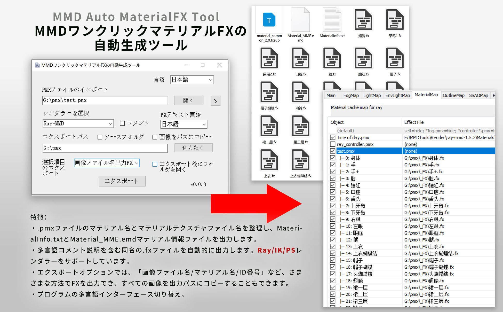
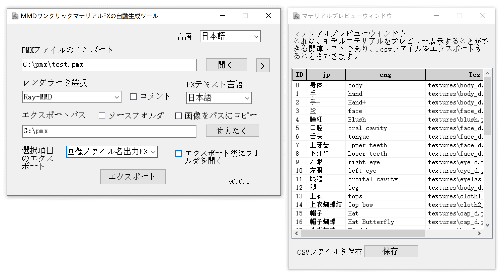
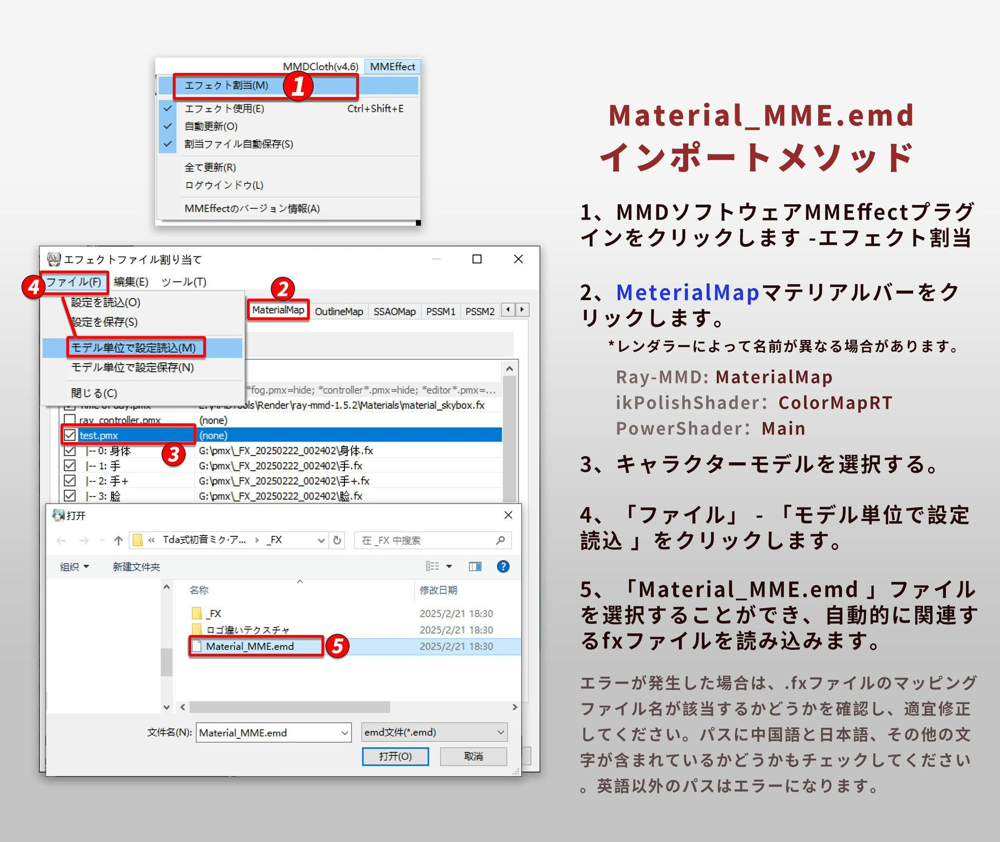

<h1 align="center">MMD Auto MaterialFX Tool</h1>

<p align="center">
<font size="10px">MMDワンクリック自動マテリアルFX生成ツール</font><br />

</p>

<p align="center">
  
  <br /><br />
  <a href="LICENSE"></a>
  <a href="https://github.com/SaraKale/MMD_Auto_MaterialFX_Tool/releases"></a>
  <a href=""></a>
  <a href=""></a>
</p>

<p align="center">
  言語：<a href="README_en.md">English</a> | <a href="README_tw.md">繁體中文</a> | <a href="README_jp.md">日本語</a>
</p>

## 紹介

このツールは、PMXファイルのマテリアルを整理し、.FXファイルをエクスポートする必要があるユーザー向けに設計されています。手動操作の煩雑さを簡素化し、作業効率を大幅に向上させることを目的としています。

以下の場合に適しています：  
- スペキュラーマップや法線マップが組み込まれたモデル  
- 自分でスペキュラーマップや法線マップを作成した場合  

## 主な機能

### 1. マテリアル情報の整理とエクスポート

- PMXファイル内のマテリアル名と画像ファイル名を自動的に整理し、`MaterialInfo.txt`と`Material_MME.emd`の2つのマテリアル情報ファイルを生成します。これにより、後続の作業が容易になります。

### 2. 自動的な.FXファイルの生成

- ツールは「**画像ファイル名/マテリアル名/ID番号**」に基づいて同名の.FXファイルを自動生成します。多言語のコメント説明をサポートし、**Ray、ik、PS**レンダラーに対応しており、さまざまなユーザーのニーズに応えます。

### 3. 柔軟なエクスポートオプション

- 複数のエクスポート方法を提供し、ユーザーは「**画像ファイル名**」、「**マテリアル名**」、または「**ID番号**」に基づいて.FXファイルを出力できます。
- PMXファイル内のすべての画像を出力パスにコピーする機能をサポートしており、ファイルの完全性と利便性を確保します。

### 4. 多言語インターフェースのサポート

- ツールのインターフェースは多言語切り替えに対応しており、異なる言語のユーザーが使いやすくなっています。

**注意**：.pmxファイルのみに対応しています。.pmdファイルの場合は、新しい.pmxファイルとして保存してから処理してください。  
アイコンは私が適当に描いたものです。最後に、ChatGPTとGitHub Copilotがコード作成を手伝ってくれたことに感謝します。

## ビデオチュートリアル

youtube：https://youtu.be/Y06DieqjSjY
bilibili：https://www.bilibili.com/video/BV1g19BYNEN3/

## ダウンロード

以下のいずれかのノードからダウンロードしてください。

| ノード | リンク |
|:---:|:---:|
| Github | [releases](https://github.com/SaraKale/MMD_Auto_MaterialFX_Tool/releases) |
| Gitee | [releases](https://gitee.com/sarakale/MMD_Auto_MaterialFX_Tool/releases) |
| bowlroll | [リンク](https://bowlroll.net/file/332134) |
| aplaybox | [リンク](https://www.aplaybox.com/details/model/bwRV3QHtSab9) |
| lanzouu | [链接](https://wwiu.lanzouu.com/b0ra0k71g 密码:2u4e) |

## 動作環境

**OS要件**：Windows 7 SP1 以降のバージョン  
**必要な環境**：Microsoft .NET Framework 4.8  
ダウンロード先：https://dotnet.microsoft.com/ja-jp/download/dotnet-framework/net48  

## 注意事項

プログラムフォルダ内の`Renderer`フォルダと`CustomRules.ini`ファイルは移動や削除しないでください。これらは.FXファイルをエクスポートするために非常に重要です。  
AIを使用してコードを作成したため、問題がある可能性があります。コードを修正したい場合は、ぜひ提案してください。ありがとうございます！

**現在の問題**：  
**ikPolishShader**が.emdファイルを読み込む際に文字化けが発生する可能性があります。どのfxsubファイルが呼び出されているか不明なため、手動でマテリアルを適用することをお勧めします。

## ビルド方法

**開発環境**：  
- OS：Windows 10  
- 環境：[Visual Studio 2022](https://visualstudio.microsoft.com/)  
- フレームワーク：.NET Framework 4.8  
- 言語：C# 12.0  

**必要なNuGetパッケージ**：  
- [PMX Parser](https://www.nuget.org/packages/PMXParser)  
- [Fody](https://www.nuget.org/packages/Fody)  
- [Costura.Fody](https://www.nuget.org/packages/Costura.Fody)  

`PMX Material Tools.sln`を実行してビルドしてください。  

または、**dotnet**を使用してビルドすることもできます：  
```
dotnet build PMX Material Tools.csproj --framework net48
```


## 使用方法

1. **MMD Auto MaterialFX Tool.exe**を直接実行します。  
2. デフォルトの言語は英語です。右上の**Language**を選択して、好きな言語に切り替えることができます。  
3. PMXファイルをインポート：  
   - 右側のボタンをクリックして`.pmx`ファイルをインポートするか、`.pmx`ファイルをアドレスバーにドラッグ＆ドロップします。  
   - ボタンの横にある`>`をクリックすると、現在のモデルのマテリアルリストを確認できます。クイックプレビューが可能で、**.csv**ファイルとしてエクスポートすることもできます。  
4. レンダラーを選択：  
   - メインレンダラーを選択します。何も選択しない場合、デフォルトでは何も出力されず、`MaterialInfo.txt`ファイルのみが出力されます。  
   - いずれかのオプションを選択すると、関連する**.fxsub / .fx**ファイルが出力されます。テクスチャファイル名に基づいて自動的に名前が変更されます。ファイル名の末尾にスペキュラーマップ`_s`/`_Specular`や法線マップ`_n`/`_Normal`が含まれている場合、.fxファイルに関連するファイルパスが自動的に追加されます。ただし、これらの名前は万能ではないため、必要に応じて修正してください。エラーが発生した場合は、テクスチャファイル名を確認するか、`CustomRules.ini`にカスタムルールを追加してください。  
     - 現在サポートされているレンダラー：  
     - Ray-MMD  
     - ikPolishShader  
     - PowerShader  
5. コメントを含める：  
   - コメントオプションをチェックし、「**FXテキスト言語**」を選択すると、コメント付きのファイルが出力されます。  
6. FXテキスト言語：  
   - .fxテキストのエンコーディング言語を選択できます。これにより、コードの確認や修正が容易になります。コメントオプションを有効にする必要があります。  
     - 現在サポートされている言語：  
     - English  
     - 简体中文  
     - 繁體中文  
     - 日本語  
7. エクスポートパス：  
   - .pmxファイルを先にインポートすると、パスが自動的に入力されます。  
   - 右側のボタンをクリックしてフォルダを手動で選択するか、パスをアドレスバーに貼り付けることもできます。  
   - 「`ソースフォルダ`」をチェックすると、テクスチャフォルダに自動的に出力されます。手動で選択する必要はありません。  
   - 「`ソース画像を出力パスにコピー`」をチェックすると、すべての画像がエクスポートフォルダにコピーされます。手動でパスを選択する場合に推奨されます。  
   - エクスポート後、「レンダラー_FX_日付_番号」というフォルダが自動的に作成されます。  
8. エクスポートオプション：  
   - エクスポート時に以下のいずれかを選択できます：  
   - "なし"：デフォルトで、MaterialInfo.txtファイルのみを出力します。  
   - "画像ファイル名出力FX"：テクスチャファイル名に基づいて.FXファイルを出力します。  
   - "マテリアル名出力FX"：マテリアル名に基づいて.FXファイルを出力します。  
   - "FXをID番号で出力"：ID番号に基づいて.FXファイルを出力します。  
9. エクスポート後にフォルダを自動的に開く：  
   - エクスポートが成功すると、フォルダが自動的に開きます。  
10. 最後に、MMDでMMEプラグインを開き、**Material**セクションで`Material_MME.emd`ファイルをインポートすると、マテリアルファイルが自動的に読み込まれます。  
    - 方法：MMEffectプラグインを開き、Materialセクションでモデルを選択し、「`ファイル`」→「`モデル単位で設定読込`」をクリックして、`Material_MME.emd`ファイルを読み込みます。これにより、マテリアルが自動的に適用されます。  
    - このプロセス中にマテリアルの順序を変更しないでください。順序を変更した場合、対応がずれる可能性があります。マテリアルの順序を変更した場合は、.emdファイルを再エクスポートする必要があります。  
    - エラーが発生した場合、.emdファイルのエンコーディング設定が間違っている可能性があります。通常、ファイルのエンコーディングを修正するか、MMEで手動でマテリアルを適用してください。  
      - 地域別の文字エンコーディング：  
      - 通常：UTF-8  
      - 簡体字中国語：GB18030  
      - 繁体字中国語：BIG5  
      - 日本語：shift_jis  
      - 韓国語：EUC-KR  
      - ロシア語：KOI8-R  
      - ラテン文字：WINDOWS1250  

## FAQ

Q: エフェクトファイルを読み込めません：xxxx.fx Error: failed to open file:  xxxx.tga (parameter: AlbedoSubMap)  
A: スペキュラーマップまたは法線マップのファイル名が正しくありません。プログラムはスペキュラーマップ`_s`/`_Specular`と法線マップ`_n`/`_Normal`の名前のみをチェックします。万能ではないため、手動で.fxファイルのパスを確認・修正してください。  

Q: インポートエラー：failed to open file: xxxx.png (parameter: NormalMap)  
A: 関連する画像ファイルが見つかりませんでした。.fxファイルをテクスチャフォルダにエクスポートまたはコピーしてください。  

Q: FXファイルが生成またはエクスポートされません。  
A: ソフトウェアを再起動して再度試してください。時々遅延バグが発生することがあります。  

Q: MaterialMapセクションでマテリアルを適用すると真っ黒になる。  
A: モデルの法線が間違っている可能性があります。モデルの法線を確認するか、.fxファイルの法線の値を調整してください。また、法線マップのファイル名が間違っている可能性もあります。対応する法線マップファイルが存在するか確認してください。  

Q: エクスポートプログラムが応答しません。  
A: ディレクトリ内に既に.fxファイルが存在するためです。不要な場合はファイルを削除して再生成してください。ただし、事前にファイルをバックアップすることを忘れないでください。  

Q: 画像ファイルのコピーに失敗しました："xxx.png"は別のプロセスで使用中です。  
A: ファイルが他のアプリケーションで使用されている可能性があります。関連するアプリケーションを閉じてから、画像をコピーしてください。  

Q: xx言語の翻訳を追加できますか？  
A: もちろんです！メッセージを残していただければ、今後のアップデートで追加します。  

## 確認済みステータス

現在、マテリアルファイルを配布できることが確認されているレンダラーは以下の通りです：  

- **Ray-MMD v1.5.2** by: Rui  
  https://github.com/ray-cast/ray-mmd  
- **ikPolishShader v_028** by: ikeno  
  https://ux.getuploader.com/ikeno/  
- **PowerShader v3.2** by: 角砂糖  
  https://bowlroll.net/user/443942  

他のレンダラーを追加する必要がある場合は、お知らせください。ただし、作者が配布を許可しているかどうかを確認する必要があります。  

## 使用条件

- 商用利用は禁止されています。  
- ソースコードの修正と再配布は許可されていますが、プログラムの問題を改善する目的に限ります。  
- このツールの使用によって発生したいかなる問題についても、作者は責任を負いません。  

## クレジット

使用ライブラリ：  
- **PMX Parser** by: ikorin24  
  https://github.com/ikorin24/PMXParser  
- **Fody** by: Fody  
  https://github.com/Fody/Fody  
- **Costura.Fody** by: geertvanhorrik, simoncropp  
  https://github.com/Fody/Costura  

AIコード支援：  
- ChatGPT  
- GitHub Copilot  

## ライセンス

[MIT License](LICENSE) でライセンスされています。  

## スクリーンショット

  
  
