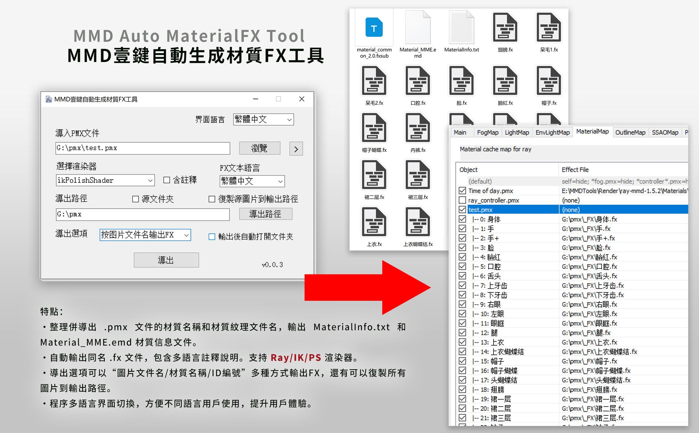
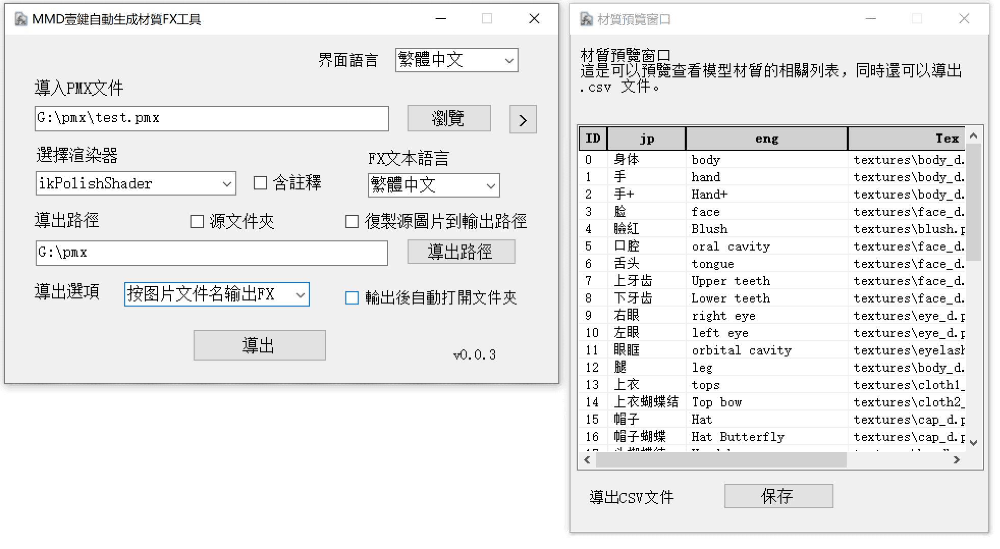
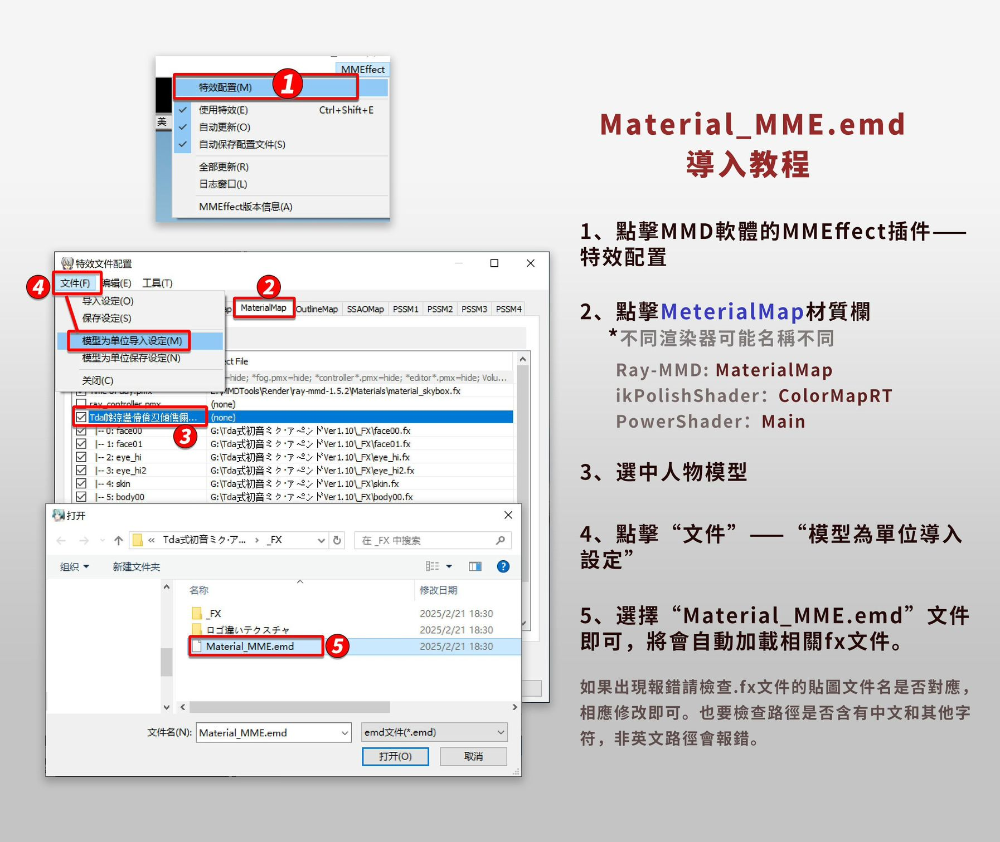

<h1 align="center">MMD Auto MaterialFX Tool</h1>

<p align="center">
<font size="10px">MMD一鍵自動生成材質FX工具</font><br />

</p>
 
<p align="center">
  
    <br /><br />
    <a href="LICENSE"></a>
    <a href="https://github.com/SaraKale/MMD_Auto_MaterialFX_Tool/releases"></a>
    <a href=""></a>
    <a href=""></a>
</p>

<p align="center">
language：<a href="README_en.md">English</a> | <a href="README.md">简体中文</a>  | <a href="README_jp.md">日本語</a>
</p>

## 介紹

本工具專為需要整理PMX文件材質併導出.FX文件的用戶設計，旨在簡化繁瑣的手動操作，顯著提升工作效率。

適用於：有自帶高光和法線貼圖的模型，或者自己做了高光和法線的貼圖文件也可以。

## 主要特點

### 1、材質信息整理與導出
    
- 自動整理PMX文件中的材質名稱和圖片文件名，生成 `MaterialInfo.txt` 和 `Material_MME.emd` 兩個材質信息文件，方便後續使用。

### 2、自動生成.FX文件
 - 工具會自動生成與“**圖片文件名/材質名稱/ID編號**”同名的.FX文件，支持多語言註釋說明，兼容**Ray、ik、PS**渲染器，滿足不同用戶的需求。

### 3、靈活的導出選項
 - 提供多種導出方式，用戶可以根據需求選擇按“**圖片文件名**”、“**材質名稱**”或“**ID編號**”輸出 **.FX** 文件。
 - 支持將PMX文件中的所有圖片復製到輸出路徑，確保文件的完整性和便捷性。

### 4、多語言界面支持
 - 工具界面支持多語言切換，方便不同語言用戶使用，提升用戶體驗。

僅適用於 **.pmx** 文件，如果是 .pmd 文件請自行保存新的 pmx 文件再處理。  
圖標是我隨便畫的，最後感謝 ChatGPT 和 Github Copilot 幫助我完成了代碼編寫。

## 視頻教程

youtube：https://youtu.be/Y06DieqjSjY  
bilibili：https://www.bilibili.com/video/BV1g19BYNEN3/

## 下載

請選擇下面任意節點下載。

|   節點    |                                    鏈接                                    |
| :------: | :-----------------------------------------------------------------------: |
|  Github  | [releases](https://github.com/SaraKale/MMD_Auto_MaterialFX_Tool/releases) |
|  Gitee   | [releases](https://gitee.com/sarakale/MMD_Auto_MaterialFX_Tool/releases)  |
| bowlroll |                  [鏈接](https://bowlroll.net/file/332134)                  |
| aplaybox |        [鏈接](https://www.aplaybox.com/details/model/bwRV3QHtSab9)         |
| lanzouu  |            [鏈接](https://wwiu.lanzouu.com/b0ra0k71g) 密碼:2u4e            |

## 運行環境

操作系統要求：Windows 7 SP1 以及 更高系統版本

需要有 Microsoft .NET Framework 4.8 運行環境  
下載：https://dotnet.microsoft.com/zh-cn/download/dotnet-framework/net48

## 註意

程序文件夾內的 `Renderer` 文件夾和 `CustomRules.ini` 文件請不要移動或刪除，它是非常重要的，用於導出 .fx 文件。  
由於我是使用了AI輔助編寫代碼，難免有問題，如果有修改代碼的意願歡迎提交，謝謝！

## 編譯構建

我的開發環境：  
系統：Windows 10  
環境：[Visual Studio 2022](https://visualstudio.microsoft.com/)  
框架：.NET Framework 4.8  
語言：C# 12.0  
需要安裝Nuget包：  
 - [PMX Parser](https://www.nuget.org/packages/PMXParser)
 - [Fody](https://www.nuget.org/packages/Fody)
- [Costura.Fody](https://www.nuget.org/packages/Costura.Fody)

直接運行`PMX Material Tools.sln`編譯即可。

或者其他方式編譯，例如**dotnet**編譯：
```
dotnet build PMX Material Tools.csproj --framework net48
```

## 使用方法

 - 1、直接運行 **MMD Auto MaterialFX Tool.exe** 程序即可。

 - 2、默認是English語言，在右上角選擇 **Language** 可以切換到妳喜歡的語言。

 - 3、導入PMX文件：
   - 點擊右邊按鈕導入 `.pmx`文件，也可以把 `.pmx` 文件直接拖入到地址欄裏。
      按鈕旁邊 `>` 是可以點擊查看當前模型的材質列表，可快速閱覽，同時還可以導出 **.csv** 文件。

- 4、選擇渲染器：
   - 這是選擇妳的主渲染，如果不選擇任何選項，默認是無，則直接輸出 `MaterialInfo.txt` 材質信息文件。
   - 選擇任意選項，將會輸出相關的 **.fxsub / .fx**文件，根據紋理文件名自動重命名為相同的名稱，如果文件名末尾含有高光貼圖 `_s`/`_Specular` 和法線貼圖 `_n`/`_Normal` 文件名，將會自動在fx文件添加相關的文件名路徑。當然這個名稱併不是通用的，具體還是要自己修改，如果出現錯誤請檢查貼圖文件名。或者自己去增加 `CustomRules.ini` 的重命名自定義規則。
   - 需要註意的是：由於MMD的語言限製，無法支持更多的編碼語言，只能將貼圖文件名修改為英文才可以解決，註意前面路徑也不要出現其他非英文字符。
     - 目前有以下渲染：
     - Ray-MMD 
     - ikPolishShader
     - PowerShader

- 5、含註釋：
   - 如果勾選註釋說明，同時選擇了“**FX文本語言**”，會輸出含有註釋說明的文件。

- 6、FX文本語言：
   - 這裏是可以選擇 .fx 文本的編碼語言，更方便查看修改代碼，需要勾選前面的註釋選項。
     - 目前有這些語言：
     - English
     - 簡體中文
     - 繁體中文
     - 日本語

- 7、導出路徑：
   - 這裏如果先導入了 .pmx 文件，它會自動填入地址。
   - 也可以手動按右邊按鈕選擇文件夾，也可以把路徑粘貼到地址欄裏。
   - 如果勾選“`源文件夾`”會自動輸出到貼圖文件夾裏面，無需手動選擇。
   - 如果勾選“`復製源圖片到輸出路徑`”會將所有圖片復製到導出文件夾，建議手動選擇路徑時使用。
   - 導出後會自動創建“渲染器_FX_日期序號”的文件夾。

- 8、導出選項：
   - 導出時可以按照喜好選擇：
   - "無"：默認只輸出 MaterialInfo.txt 文件。
   - "按圖片文件名輸出FX"：輸出以貼圖文件名命名的.fx文件。
   - "按材質名稱輸出FX"：輸出以材質名稱命名的.fx文件。
   - "按ID編號輸出FX"：輸出以ID數字編號命名的.fx文件。    
- 9、輸出後自動打開文件夾：
   - 當輸出成功後會自動打開導出的文件夾。

- 10、最後可以到 MMD 裏打開 MME 插件在 **Material** 欄導入 `Material_MME.emd` 文件，將會自動加載材質文件。
   - 方法是打開 MMEffect 插件，在 Material 欄選中模型，然後點擊“`文件`”——“`模型為單位導入設定`”，載入 `Material_MME.emd` 文件，就會自動上材質了。
   - 在此期間盡量不要更改材質順序，否則會對應不上，如果改變了材質順序則需要重新輸出 .emd 文件。
   - 如果出現報錯則是 .emd 文件語言編碼設置錯誤，通常修改文件編碼即可，或者自己重新在MME賦予材質。
     - 各地區字符編碼：
     - 通常：UTF-8
     - 簡體中文：GB18030
     - 繁體中文：BIG5
     - 日語：shift_jis
     - 朝鮮：EUC-KR
     - 俄羅斯：KOI8-R
     - 拉丁字符：WINDOWS1250


## 問題解答 FAQ

Q：無法邊加載特效文件：xxxx.fx  Error:failed to open file: xxxx.tga (parameter:AlbedoSubMap)  
A：這是因為高光貼圖文件名和法線貼圖文件名名稱不對，程序只判斷了高光貼圖 _s/_Specular 和法線貼圖 _n/_Normal的名稱，無法做到全部通用，請自行檢查修改 .fx 的文件路徑。  

Q：導入Error:failed to open file:xxxx.png (parameter:NormalMap)    
A：這是因為沒有找到相關的圖片，請將 .fx 文件導出或復製到貼圖文件夾裏面。  

Q：加載fx文件出現亂碼，如：無法邊加載特效文件：xxx.fx  
Error:failed to open file:鞋先鞋揎篩肄箋鋒奸牠s.png(parameter:AlbedoSubMap)  
Error:failed to open file:鞋先鞋掊篩肄箋肄奸牠n.png(parameter:NormalMap)  
A：這是因為由於MMD的語言限製，無法支持更多的編碼語言，只能將貼圖文件名修改為英文才可以解決，註意前面路徑也不要出現其他非英文字符。建議導出輸出到模型所在的目錄，目前對於全中文/日語路徑沒有較好的解決辦法。  

Q：FX文件沒有生成導出。  
A：請重啟軟體再嘗試壹次，因為偶爾會有點延遲BUG……  

Q：MaterialMap欄貼上材質後變黑  
A：可能是模型法線錯誤，請檢查模型的法線，或者調整 .fx 文件法線的數值，也有可能是法線貼圖文件名錯誤，請檢查是否有對應的法線貼圖文件。

Q：導出程序未響應  
A：這是因為目錄內已有.fx文件，如果不需要可刪除文件再重新生成，記得提前備份文件。

Q：復製圖片文件失敗："xxx.png"正由另壹進程使用，因此該進程無法訪問此文件。  
A：這是因為當前文件可能在被其他應用占用，請關閉相關占用的程序，然後再復製圖片即可。

Q：我可以申請添加 xx 翻譯語言嗎？  
A：當然可以！請給我留言，我會在後續新增。

## 確認狀態

目前確認可以分發材質文件的渲染器如下：

Ray-MMD v1.5.2 	by:Rui  
https://github.com/ray-cast/ray-mmd  
ikPolishShader v_028	by:ikeno  
https://ux.getuploader.com/ikeno/  
PowerShader v3.2		by:角砂糖  
https://bowlroll.net/file/195743  

如果有需要添加的渲染器可以告知我，我會添加上去，不過還是要查看作者是否允許分發。

## 使用事項

 - 禁止任何商業性質行為
 - 允許修改源碼再發布，用於完善程序問題。
 - 關於使用工具產生的任何問題，作者概不負責。

## 來源

使用庫：  
PMX Parser         by:ikorin24  
https://github.com/ikorin24/PMXParser  
Fody       by:Fody  
https://github.com/Fody/Fody  
Costura.Fody     by:geertvanhorrik,simoncropp  
https://github.com/Fody/Costura  

AI代碼輔助：  
ChatGPT  
Github Copilot  

## 許可證

使用 [MIT License](LICENSE) 許可證

## 截圖展示




